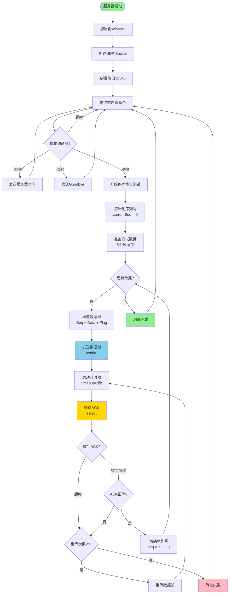
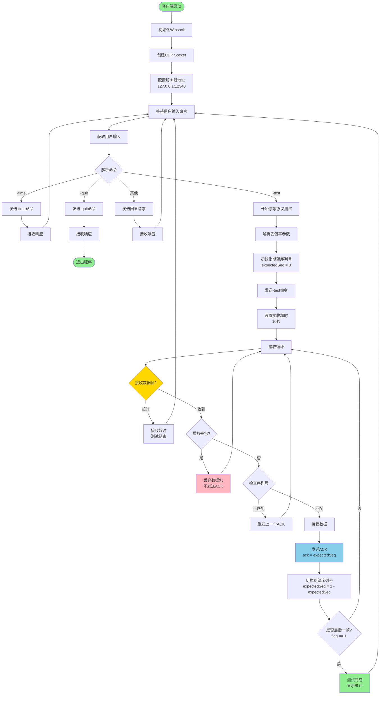
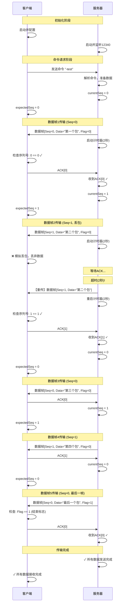
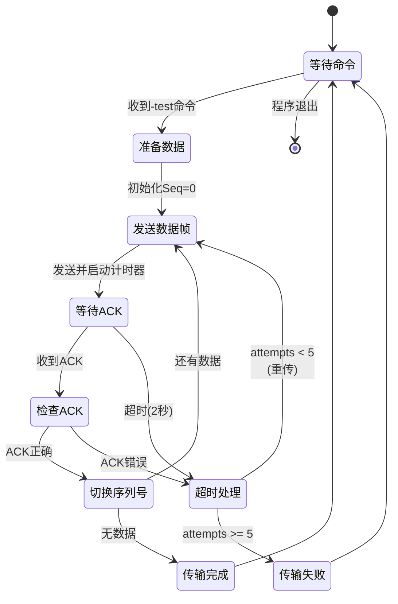
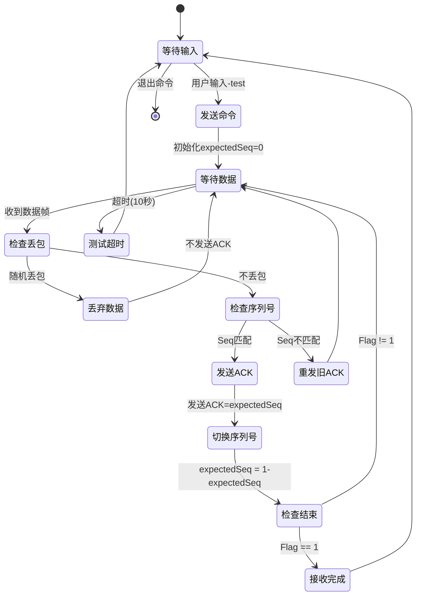
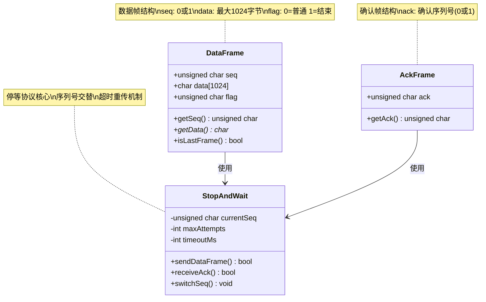
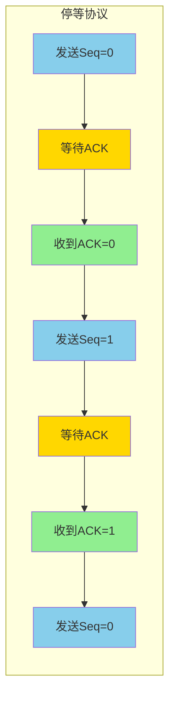

# 停等协议流程图

本文档使用Mermaid语法展示停等协议的详细流程。

## 1. 服务器端流程图



## 2. 客户端流程图



## 3. 停等协议交互序列图



## 4. 停等协议状态转换图

### 服务器状态机



### 客户端状态机



## 5. 数据结构图



## 6. 时序关系图

```mermaid
gantt
    title 停等协议传输时间线 (5个数据包)
    dateFormat X
    axisFormat %L ms

    section 数据包1(Seq=0)
    发送数据帧     :a1, 0, 10ms
    等待ACK       :a2, 10, 50ms
    收到ACK       :milestone, a3, 60

    section 数据包2(Seq=1)
    发送数据帧     :b1, 70, 10ms
    等待ACK       :b2, 80, 2000ms
    超时!         :crit, b3, 2080, 10ms
    重传数据帧     :b4, 2090, 10ms
    等待ACK       :b5, 2100, 50ms
    收到ACK       :milestone, b6, 2150

    section 数据包3(Seq=0)
    发送数据帧     :c1, 2160, 10ms
    等待ACK       :c2, 2170, 50ms
    收到ACK       :milestone, c3, 2220

    section 数据包4(Seq=1)
    发送数据帧     :d1, 2230, 10ms
    等待ACK       :d2, 2240, 50ms
    收到ACK       :milestone, d3, 2290

    section 数据包5(Seq=0)
    发送数据帧     :e1, 2300, 10ms
    等待ACK       :e2, 2310, 50ms
    收到ACK       :milestone, e3, 2360
```

## 7. 协议对比图



## 使用说明

这些流程图可以在支持Mermaid的环境中渲染，例如：
- GitHub/GitLab的Markdown文件
- VS Code (安装Mermaid插件)
- 在线编辑器: https://mermaid.live/

### 在Markdown中使用

直接将上述代码块复制到Markdown文件中，Mermaid渲染器会自动生成图表。

### 流程图说明

1. **服务器端流程图**: 展示服务器从启动到处理停等协议的完整流程
2. **客户端流程图**: 展示客户端从启动到接收数据的完整流程
3. **交互序列图**: 展示客户端和服务器之间的详细交互过程
4. **状态转换图**: 展示协议状态机的转换关系
5. **数据结构图**: 展示关键数据结构和类关系
6. **时序关系图**: 展示实际传输中的时间分布
7. **协议对比图**: 展示停等协议的基本工作模式
