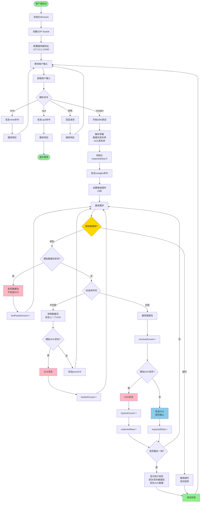
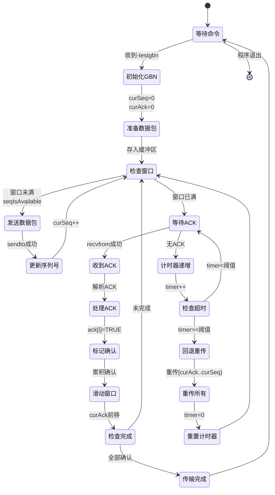
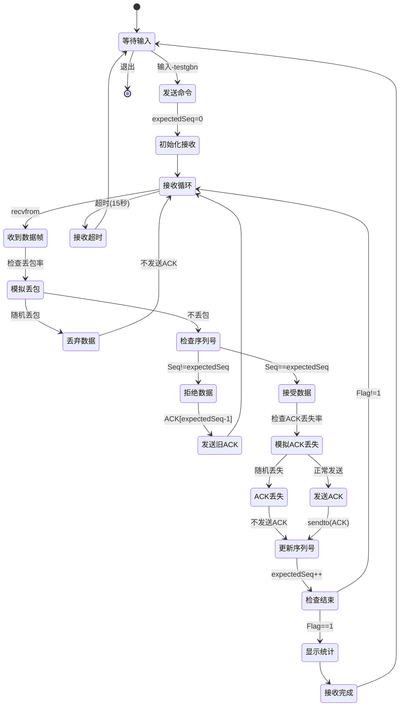
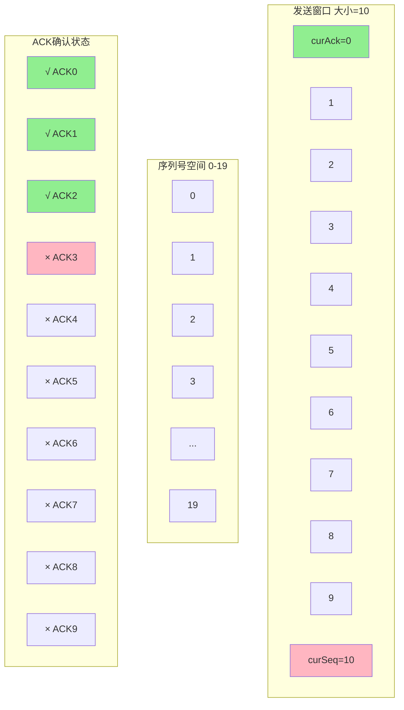
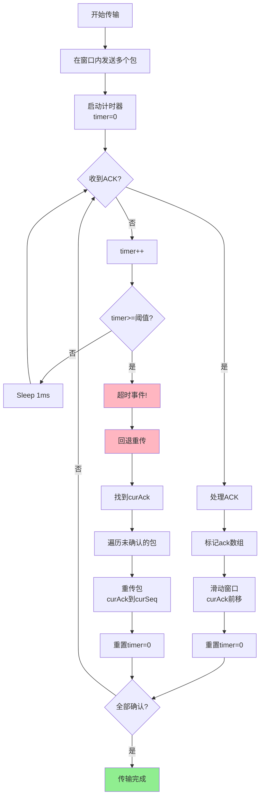
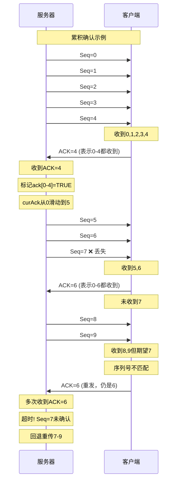
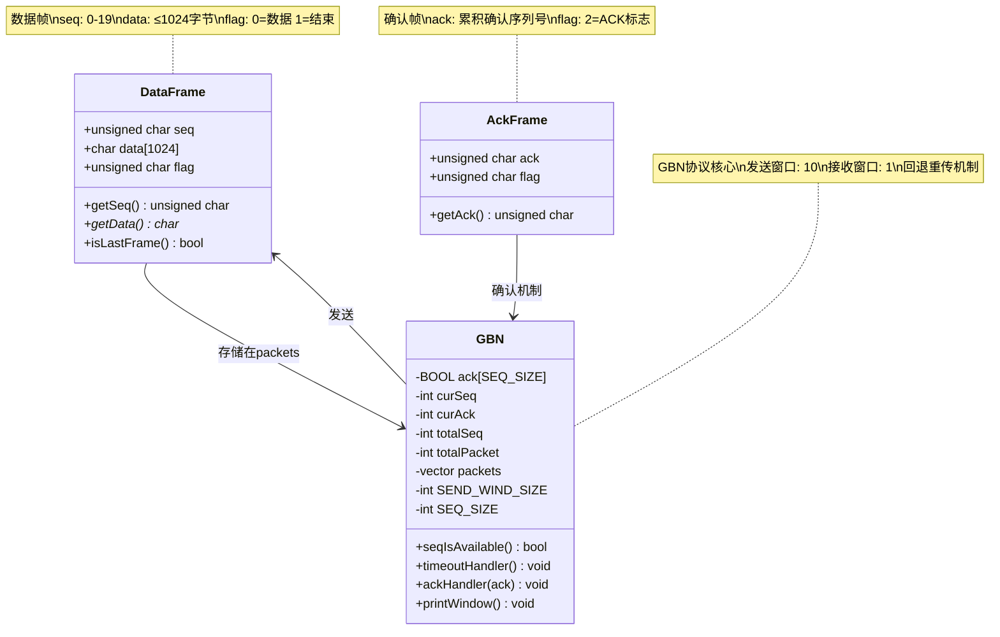

# GBN协议流程图

本文档使用Mermaid语法展示GBN(Go-Back-N)协议的详细流程。

## 1. 服务器端流程图

```mermaid
flowchart TD
    Start([服务器启动]) --> Init[初始化Winsock]
    Init --> CreateSocket[创建UDP Socket]
    CreateSocket --> SetNonBlock[设置非阻塞模式<br/>ioctlsocket]
    SetNonBlock --> Bind[绑定端口12340]
    Bind --> WaitCmd[等待客户端命令]

    WaitCmd --> RecvCmd{接收到命令?}
    RecvCmd -->|无数据| Sleep1[Sleep 1ms]
    Sleep1 --> WaitCmd
    RecvCmd -->|-time| SendTime[发送服务器时间]
    RecvCmd -->|-quit| SendBye[发送Goodbye]
    RecvCmd -->|-testgbn| StartGBN[开始GBN协议测试]

    SendTime --> WaitCmd
    SendBye --> WaitCmd

    StartGBN --> InitGBN[初始化GBN参数<br/>curSeq=0, curAck=0<br/>清空ack数组]
    InitGBN --> PreparePackets[准备数据包<br/>15个测试数据]
    PreparePackets --> StoreBuffer[存入发送缓冲区<br/>packets数组]

    StoreBuffer --> GBNLoop{传输完成?}

    GBNLoop -->|否| CheckWindow{窗口允许发送?<br/>seqIsAvailable}
    GBNLoop -->|是| TestComplete[GBN测试完成]

    CheckWindow -->|是| SendPacket[发送数据包<br/>packets[curSeq]]
    CheckWindow -->|否| TryRecvACK[尝试接收ACK]

    SendPacket --> IncSeq[curSeq++<br/>totalSeq++]
    IncSeq --> ResetTimer[重置计时器<br/>timer=0]
    ResetTimer --> TryRecvACK

    TryRecvACK --> RecvResult{收到ACK?}

    RecvResult -->|是| HandleACK[处理ACK<br/>ackHandler]
    RecvResult -->|否| IncTimer[timer++]

    HandleACK --> UpdateAck[标记已确认<br/>ack[i]=TRUE]
    UpdateAck --> SlideWindow[滑动窗口<br/>while ack[curAck]]
    SlideWindow --> ResetTimer2[重置计时器<br/>timer=0]
    ResetTimer2 --> CheckComplete{全部确认?}

    IncTimer --> CheckTimeout{超时?<br/>timer>=threshold}
    CheckTimeout -->|否| Sleep2[Sleep 1ms]
    CheckTimeout -->|是| Timeout[超时处理]

    Sleep2 --> GBNLoop

    Timeout --> GoBackN[回退重传<br/>重传curAck到curSeq<br/>所有未确认的包]
    GoBackN --> ResetTimer3[重置计时器<br/>timer=0]
    ResetTimer3 --> GBNLoop

    CheckComplete -->|是| GBNLoop
    CheckComplete -->|否| GBNLoop

    TestComplete --> WaitCmd

    style Start fill:#90EE90
    style TestComplete fill:#90EE90
    style SendPacket fill:#87CEEB
    style GoBackN fill:#FFB6C1
    style TryRecvACK fill:#FFD700
    style CheckWindow fill:#DDA0DD
```

## 2. 客户端流程图



## 3. GBN协议交互序列图

```mermaid
sequenceDiagram
    participant C as 客户端
    participant S as 服务器

    Note over C,S: 初始化阶段
    C->>C: 启动，设置丢包率
    S->>S: 启动，非阻塞模式

    Note over C,S: 命令请求阶段
    C->>S: 发送 "-testgbn"
    S->>S: 初始化GBN<br/>curSeq=0, curAck=0<br/>窗口大小=10

    Note over C,S: GBN传输阶段 - 发送窗口
    S->>C: 数据帧[Seq=0]
    S->>C: 数据帧[Seq=1]
    S->>C: 数据帧[Seq=2]
    S->>C: 数据帧[Seq=3] ❌ 丢失
    S->>C: 数据帧[Seq=4]
    S->>C: 数据帧[Seq=5]
    S->>C: ...
    S->>C: 数据帧[Seq=9]
    Note over S: 窗口已满，等待ACK

    Note over C,S: 客户端接收和ACK
    C->>C: 收到Seq=0, expectedSeq=0 ✓
    C->>S: ACK[0] (累积确认)
    C->>C: expectedSeq=1

    C->>C: 收到Seq=1, expectedSeq=1 ✓
    C->>S: ACK[1]
    C->>C: expectedSeq=2

    C->>C: 收到Seq=2, expectedSeq=2 ✓
    C->>S: ACK[2]
    C->>C: expectedSeq=3

    Note over C: Seq=3丢失，未收到

    C->>C: 收到Seq=4, expectedSeq=3 ✗
    C->>C: 序列号不匹配!
    C->>S: ACK[2] (重发上一个)

    C->>C: 收到Seq=5, expectedSeq=3 ✗
    C->>S: ACK[2]

    Note over C,S: 服务器端处理ACK
    S->>S: 收到ACK[0]<br/>ack[0]=TRUE<br/>curAck滑动到1
    S->>S: 收到ACK[1]<br/>ack[1]=TRUE<br/>curAck滑动到2
    S->>S: 收到ACK[2]<br/>ack[2]=TRUE<br/>curAck滑动到3

    S->>S: 收到ACK[2] (重复)<br/>ack[2]已经TRUE<br/>curAck仍为3

    Note over S: 超时! Seq=3未确认

    Note over C,S: GBN回退重传
    S->>C: 【回退重传】Seq=3
    S->>C: 【回退重传】Seq=4
    S->>C: 【回退重传】Seq=5
    S->>C: 【回退重传】Seq=6
    S->>C: 【回退重传】Seq=7
    S->>C: 【回退重传】Seq=8
    S->>C: 【回退重传】Seq=9

    Note over S: 重传窗口内所有未确认的包

    Note over C,S: 客户端接收重传数据
    C->>C: 收到Seq=3, expectedSeq=3 ✓
    C->>S: ACK[3]
    C->>C: expectedSeq=4

    C->>C: 收到Seq=4, expectedSeq=4 ✓
    C->>S: ACK[4]

    C->>C: 收到Seq=5, expectedSeq=5 ✓
    C->>S: ACK[5]

    Note over C,S: 继续传输...
    S->>C: 数据帧[Seq=10]
    S->>C: ...
    S->>C: 数据帧[Seq=14, Flag=1]

    C->>S: ACK[14]

    Note over C,S: 传输完成
    S->>S: ✓ 全部确认
    C->>C: ✓ 全部接收
```



## 4. GBN状态转换图

### 服务器状态机



### 客户端状态机



## 5. 滑动窗口示意图



## 6. GBN vs 停等协议对比图

```mermaid
graph TB
    subgraph 停等协议[停等协议 - 窗口大小1]
        direction LR
        SW1[发送Seq=0] --> SW2[等待ACK]
        SW2 --> SW3[收到ACK]
        SW3 --> SW4[发送Seq=1]
        SW4 --> SW5[等待ACK]
        SW5 --> SW6[收到ACK]
    end

    subgraph GBN协议[GBN协议 - 窗口大小10]
        direction LR
        GBN1[连续发送<br/>Seq=0-9] --> GBN2[等待ACK们]
        GBN2 --> GBN3[收到ACK0-2]
        GBN3 --> GBN4[窗口滑动]
        GBN4 --> GBN5[发送Seq=10-12]
        GBN5 --> GBN6[超时!<br/>Seq=3未确认]
        GBN6 --> GBN7[回退重传<br/>Seq=3-12]
    end

    style SW2 fill:#FFD700
    style SW5 fill:#FFD700
    style GBN2 fill:#FFD700
    style GBN7 fill:#FFB6C1
```



## 7. 超时重传机制流程图



## 8. 累积确认机制图



## 9. 数据结构关系图



## 10. 时序关系图 (含超时重传)

```mermaid
gantt
    title GBN协议传输时间线 (含超时重传场景)
    dateFormat X
    axisFormat %L ms

    section 窗口发送(Seq=0-9)
    发送Seq=0-9   :a1, 0, 100ms
    等待ACK       :a2, 100, 50ms

    section ACK接收
    收到ACK=0-2   :b1, 150, 30ms
    窗口滑动      :milestone, 180

    section 继续发送(Seq=10-12)
    发送Seq=10-12 :c1, 190, 30ms

    section 超时检测
    等待ACK=3     :d1, 220, 500ms
    超时!         :crit, d2, 720, 10ms

    section 回退重传
    重传Seq=3-12  :e1, 730, 100ms
    收到ACK=3-12  :e2, 830, 80ms
    传输恢复      :milestone, 910

    section 继续传输
    发送Seq=13-14 :f1, 920, 20ms
    收到ACK       :f2, 940, 30ms
    完成          :milestone, 970
```



## 使用说明

### 渲染这些图表

可以在以下环境中渲染：
- **GitHub/GitLab**: 直接支持Mermaid
- **VS Code**: 安装 "Markdown Preview Mermaid Support" 插件
- **在线编辑器**: https://mermaid.live/
- **Typora**: 内置Mermaid支持

### 图表说明

1. **服务器端流程图**: GBN服务器的完整处理流程，包括窗口管理和超时处理
2. **客户端流程图**: GBN客户端的接收流程，包括丢包模拟
3. **交互序列图**: 详细展示GBN的回退重传过程
4. **状态转换图**: 双方的状态机转换关系
5. **滑动窗口示意图**: 窗口结构和ACK状态
6. **对比图**: GBN vs 停等协议的效率对比
7. **超时重传机制**: 详细的重传处理流程
8. **累积确认机制**: 展示累积ACK的工作原理
9. **数据结构图**: 关键类和数据结构
10. **时序关系图**: 实际传输的时间分布

### GBN关键特性

- ✅ **发送窗口**: 大小为10，可连续发送
- ✅ **累积确认**: ACK=n表示n及之前都已收到
- ✅ **回退重传**: 超时后重传所有未确认的包
- ✅ **接收窗口**: 大小为1，只能按序接收
- ⚠️ **效率**: 高于停等，但重传开销可能较大
