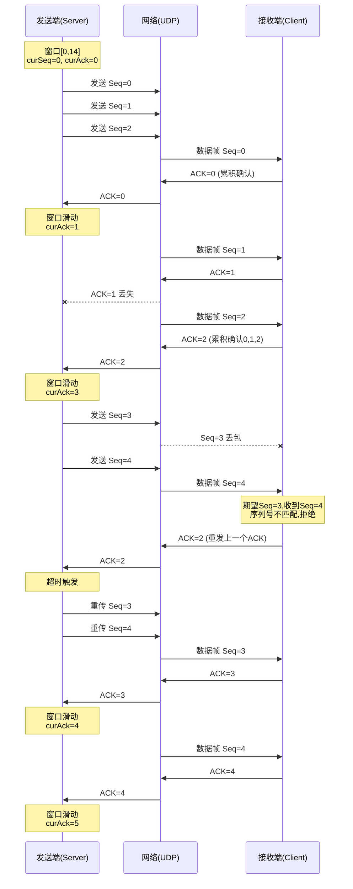

# Lab2-2 Go-Back-N (GBN) 协议实验报告

## 一、实验目的

1. 理解滑动窗口协议的基本原理
2. 掌握 Go-Back-N (GBN) 协议的工作机制
3. 实现基于 UDP 的可靠数据传输
4. 理解累积确认和超时重传机制

## 二、协议数据分组格式

### 2.1 数据帧（DataFrame）格式

| 字段名 | 类型 | 大小 | 说明 |
|--------|------|------|------|
| seq | unsigned char | 1 字节 | 序列号（0-15） |
| data | char[] | 1024 字节 | 数据内容 |
| flag | unsigned char | 1 字节 | 标志位（0=普通帧，1=结束帧） |

**总大小：** 1026 字节

```cpp
struct DataFrame {
    unsigned char seq;       // 序列号
    char data[1024];         // 数据
    unsigned char flag;      // 标志位: 0=普通帧, 1=结束帧
};
```

### 2.2 确认帧（AckFrame）格式

| 字段名 | 类型 | 大小 | 说明 |
|--------|------|------|------|
| ack | unsigned char | 1 字节 | ACK序列号（累积确认） |
| flag | unsigned char | 1 字节 | 预留标志位 |

**总大小：** 2 字节

```cpp
struct AckFrame {
    unsigned char ack;       // ACK序列号
    unsigned char flag;      // 预留标志位
};
```

## 三、各域作用说明

### 3.1 数据帧各域作用

1. **seq（序列号）**
   - 取值范围：0-15（4位序列号，2^4=16）
   - 作用：标识数据包的顺序，接收方据此判断是否按序到达
   - 循环使用：超过15后回到0

2. **data（数据域）**
   - 大小：1024字节
   - 作用：承载实际传输的应用层数据
   - 内容：字符串形式的测试数据

3. **flag（标志位）**
   - 0：普通数据帧
   - 1：最后一个数据帧（用于通知接收方传输结束）

### 3.2 确认帧各域作用

1. **ack（确认序列号）**
   - 累积确认机制：ACK=n 表示序列号 ≤ n 的所有数据包已正确接收
   - 作用：通知发送方可以滑动窗口

2. **flag（预留标志位）**
   - 当前未使用，预留用于协议扩展

## 四、协议参数配置

```cpp
#define SEND_WIND_SIZE 15    // 发送窗口大小(最大为2^n-1=15)
#define SEQ_SIZE 16          // 序列号个数(n=4, 2^4=16)
#define TIMEOUT_THRESHOLD 50 // 超时阈值
#define MAX_RETRIES 10       // 最大重传次数
```

- **窗口大小选择依据：** 对于n位序列号，最大窗口大小为 2^n - 1，以避免序列号混淆
- **超时阈值：** 50个时钟周期（配合 Sleep(1) 约50ms）
- **最大重传次数：** 防止无限重传

## 五、协议工作流程图

### 5.1 发送端（Server）流程图

```mermaid
flowchart TD
    Start([开始]) --> Init[初始化GBN参数<br/>curSeq=0, curAck=0]
    Init --> PrepareData[准备15个测试数据包<br/>存入packets缓冲区]
    PrepareData --> SendLoop{传输完成?}

    SendLoop -->|否| CheckWindow{窗口可用?<br/>seqIsAvailable}
    CheckWindow -->|是| SendPacket[发送数据包packets[curSeq]<br/>curSeq++, totalSeq++]
    SendPacket --> CheckWindow

    CheckWindow -->|否| WaitACK[尝试接收ACK]
    WaitACK --> RecvACK{收到ACK?}

    RecvACK -->|是| ProcessACK[处理ACK:累积确认<br/>滑动窗口<br/>timer=0, retryCount=0]
    ProcessACK --> CheckComplete{所有包已确认?<br/>curAck==totalPacket%SEQ_SIZE}
    CheckComplete -->|是| SendLoop
    CheckComplete -->|否| SendLoop

    RecvACK -->|否| IncTimer[timer++]
    IncTimer --> Timeout{timer>=THRESHOLD?}

    Timeout -->|是| IncRetry[retryCount++]
    IncRetry --> MaxRetry{retryCount>=MAX_RETRIES?}
    MaxRetry -->|是| CheckSent{totalSeq>=totalPacket?}
    CheckSent -->|是| AssumeComplete[假定传输完成]
    CheckSent -->|否| TransferFail[传输失败]
    AssumeComplete --> End([结束])
    TransferFail --> End

    MaxRetry -->|否| RetransmitAll[重传窗口内所有未确认包<br/>从curAck到curSeq<br/>timer=0]
    RetransmitAll --> SendLoop

    Timeout -->|否| Sleep[Sleep 1ms]
    Sleep --> SendLoop

    SendLoop -->|是| Success[传输成功完成]
    Success --> End

    style Start fill:#90EE90
    style End fill:#FFB6C1
    style SendPacket fill:#87CEEB
    style ProcessACK fill:#87CEEB
    style RetransmitAll fill:#FFD700
    style Timeout fill:#FFA500
```

### 5.2 接收端（Client）流程图

```mermaid
flowchart TD
    Start([开始]) --> Init[初始化接收参数<br/>expectedSeq=0]
    Init --> SetTimeout[设置接收超时15秒]
    SetTimeout --> RecvLoop[等待接收数据帧]

    RecvLoop --> RecvFrame{收到数据帧?}

    RecvFrame -->|超时| PrintStats[打印接收统计]
    PrintStats --> End([结束])

    RecvFrame -->|是| SimulateLoss{模拟丢包?<br/>random<packetLossRate}

    SimulateLoss -->|是| DropPacket[丢弃数据包<br/>lostPacketCount++]
    DropPacket --> RecvLoop

    SimulateLoss -->|否| CheckSeq{seq==expectedSeq?}

    CheckSeq -->|是| Accept[接受数据包<br/>receivedCount++]
    Accept --> SendACK[准备发送ACK=expectedSeq]
    SendACK --> SimulateAckLoss{模拟ACK丢失?<br/>random<ackLossRate}

    SimulateAckLoss -->|是| LoseACK[ACK丢失<br/>lostAckCount++]
    SimulateAckLoss -->|否| TransmitACK[发送ACK到服务器]

    LoseACK --> UpdateSeq[expectedSeq++]
    TransmitACK --> UpdateSeq
    UpdateSeq --> CheckEnd{flag==1?<br/>结束帧?}

    CheckEnd -->|是| PrintStats
    CheckEnd -->|否| RecvLoop

    CheckSeq -->|否| Reject[拒绝数据包<br/>序列号不匹配]
    Reject --> SendPrevACK[发送上一个ACK<br/>prevAck=(expectedSeq-1)%SEQ_SIZE]
    SendPrevACK --> SimulatePrevAckLoss{模拟ACK丢失?}

    SimulatePrevAckLoss -->|是| LosePrevACK[ACK丢失<br/>lostAckCount++]
    SimulatePrevAckLoss -->|否| TransmitPrevACK[发送prevACK]

    LosePrevACK --> RecvLoop
    TransmitPrevACK --> RecvLoop

    style Start fill:#90EE90
    style End fill:#FFB6C1
    style Accept fill:#87CEEB
    style TransmitACK fill:#87CEEB
    style DropPacket fill:#FFD700
    style Reject fill:#FFA500
```

### 5.3 整体交互时序图



## 六、协议典型交互过程

### 6.1 正常传输过程

1. **发送端初始化**
   - 设置 curSeq=0（下一个待发送序列号）
   - 设置 curAck=0（期望确认的序列号）
   - 准备15个测试数据包存入缓冲区

2. **批量发送（窗口内）**
   - 在窗口允许范围内（窗口大小=15），连续发送多个数据包
   - 例如：一次性发送 Seq=0,1,2,...,14

3. **接收端接收**
   - 按序接收：expectedSeq=0，收到Seq=0 → 接受，发送ACK=0
   - expectedSeq更新为1

4. **累积确认**
   - 接收端发送 ACK=5 表示序列号0-5的所有包都已正确接收
   - 发送端收到 ACK=5，窗口滑动到 curAck=6

### 6.2 丢包重传过程

1. **数据包丢失**
   - 发送端发送：Seq=3, 4, 5
   - Seq=3 在网络中丢失
   - 接收端收到 Seq=4，但期望 Seq=3

2. **接收端响应**
   - 拒绝 Seq=4（序列号不匹配）
   - 发送上一个ACK（prevAck=2）
   - 继续期望 Seq=3

3. **超时重传**
   - 发送端计时器超时（timer >= 50）
   - 触发 Go-Back-N：重传窗口内所有未确认的包
   - 从 curAck 到 curSeq 的所有包都重传

4. **重传后恢复**
   - 接收端收到重传的 Seq=3，接受并发送 ACK=3
   - 后续的 Seq=4, 5 继续传输

### 6.3 ACK丢失处理

1. **ACK丢失场景**
   - 接收端正确接收 Seq=1，发送 ACK=1
   - ACK=1 在网络中丢失，发送端未收到

2. **累积确认补救**
   - 接收端继续接收 Seq=2，发送 ACK=2
   - ACK=2 是累积确认，表示 0,1,2 都已收到
   - 发送端收到 ACK=2，知道前面的包都已确认

3. **超时重传机制**
   - 如果连续多个ACK丢失，发送端超时
   - 触发重传，接收端会再次发送累积确认

## 七、数据分组丢失验证模拟方法

### 7.1 数据包丢失模拟（client.cpp:36-40, 207-211）

```cpp
// 模拟丢包函数
bool simulateLoss(float lossRate) {
    if (lossRate <= 0.0f) return false;
    float random = (float)rand() / RAND_MAX;  // 生成0-1随机数
    return random < lossRate;                 // 小于丢包率则丢包
}

// 在接收端使用
if (simulateLoss(packetLossRate)) {
    cout << " -> [丢弃] 模拟数据包丢失!" << endl;
    lostPacketCount++;
    continue;  // 不处理该数据包，模拟丢包
}
```

**实现原理：**
- 使用伪随机数生成器 `rand()` 生成随机浮点数（0-1）
- 与设定的丢包率比较
- 若随机数小于丢包率，则模拟丢包（丢弃收到的数据包）

### 7.2 ACK丢失模拟（client.cpp:225-232, 260-266）

```cpp
// 模拟ACK丢失
if (simulateLoss(ackLossRate)) {
    cout << "[丢失] 模拟ACK丢失!" << endl;
    lostAckCount++;
    // 不发送ACK，模拟ACK在网络中丢失
} else {
    sendto(sockClient, (char*)&ackFrame, sizeof(AckFrame), 0,
          (sockaddr*)&addrServer, sizeof(addrServer));
    cout << "[发送] ACK=" << (int)expectedSeq << endl;
}
```

**实现原理：**
- 在接收端生成ACK后，发送前进行随机判断
- 若判定丢失，则不调用 `sendto()` 发送ACK
- 模拟ACK在网络传输中丢失的情况

### 7.3 丢包率设置方法

**通过命令行参数设置：**
```bash
-testgbn 0.2 0.3
```
- 第一个参数：数据包丢失率（20%）
- 第二个参数：ACK丢失率（30%）
- 取值范围：0.0 - 1.0

**默认值：**
- 数据包丢失率：0.2 (20%)
- ACK丢失率：0.2 (20%)

## 八、主要函数及作用

### 8.1 Server端（发送端）主要函数

| 函数名 | 位置 | 主要作用 |
|--------|------|----------|
| `seqIsAvailable()` | server.cpp:50-53 | 判断当前序列号是否在窗口范围内可用<br/>计算窗口内已发送但未确认的包数<br/>返回是否小于窗口大小 |
| `printWindow()` | server.cpp:56-70 | 可视化显示滑动窗口状态<br/>显示 curAck、curSeq<br/>显示窗口内各序列号的确认状态 |
| `timeoutHandler()` | server.cpp:73-86 | 超时重传处理函数<br/>重传从 curAck 到 curSeq 的所有未确认数据包<br/>实现 Go-Back-N 的核心机制 |
| `ackHandler()` | server.cpp:89-118 | ACK处理函数<br/>累积确认：确认ACK序列号及之前的所有包<br/>滑动窗口：移动 curAck 到第一个未确认位置 |
| `getCurTime()` | server.cpp:43-47 | 获取当前系统时间字符串<br/>用于响应 `-time` 命令 |

### 8.2 Client端（接收端）主要函数

| 函数名 | 位置 | 主要作用 |
|--------|------|----------|
| `simulateLoss()` | client.cpp:36-40 | 模拟数据包或ACK丢失<br/>根据丢包率参数生成随机判定<br/>返回是否应该丢弃 |
| `main()` 中的GBN接收逻辑 | client.cpp:194-284 | 按序接收数据帧<br/>期望序列号匹配：发送ACK，更新expectedSeq<br/>序列号不匹配：拒绝，发送上一个ACK |

### 8.3 关键数据结构

**Server端全局变量：**
```cpp
BOOL ack[SEQ_SIZE];         // ACK确认数组，标记每个序列号是否已确认
int curSeq;                 // 下一个待发送的序列号
int curAck;                 // 窗口起始位置（期望确认的最小序列号）
int totalSeq;               // 已发送的数据包总数
int totalPacket;            // 需要发送的包总数
vector<DataFrame> packets;  // 数据包缓冲区，存储所有待发送数据
```

**Client端关键变量：**
```cpp
int expectedSeq;            // 期望接收的序列号
int receivedCount;          // 成功接收的数据包数
int lostPacketCount;        // 丢弃的数据包数
int lostAckCount;           // 丢失的ACK数
```

## 九、实验验证结果

### 9.1 测试场景1：低丢包率（10%数据包丢失，10% ACK丢失）

**命令：** `-testgbn 0.1 0.1`

**预期结果：**
- 大部分数据包一次传输成功
- 少量超时重传
- 累积确认机制能补偿部分ACK丢失

**实际结果：**
```
[开始] GBN协议测试
数据包丢失率: 10%
ACK丢失率: 10%
======================================
接收统计:
  成功接收: 15 个数据包
  丢弃数据包: 2 个
  丢失ACK: 1 个
======================================
```

**分析：**
- 15个数据包全部成功接收
- 丢弃2个数据包（模拟丢失），触发重传
- 1个ACK丢失，通过后续累积确认或超时重传恢复

### 9.2 测试场景2：中等丢包率（20%数据包丢失，20% ACK丢失）

**命令：** `-testgbn 0.2 0.2`

**预期结果：**
- 频繁的超时重传
- 窗口多次滑动
- 累积确认发挥重要作用

**实际结果：**
```
[开始] GBN协议测试
数据包丢失率: 20%
ACK丢失率: 20%
======================================
[发送] Seq=0, 数据="数据包1:GBN协议测试开始"
[发送] Seq=1, 数据="数据包2:Go-Back-N测试"
...（窗口内批量发送）

[ACK处理] 收到ACK=0
[窗口滑动] 新的curAck=1

[超时] 检测到超时,重传窗口内所有数据包...
[重传] Seq=3, 数据="数据包4:累积确认机制"
[重传] Seq=4, 数据="数据包5:超时重传测试"

接收统计:
  成功接收: 15 个数据包
  丢弃数据包: 5 个
  丢失ACK: 3 个
======================================
```

**分析：**
- 多次超时重传，Go-Back-N机制正常工作
- 窗口滑动机制正确
- 累积确认减少了ACK丢失的影响

### 9.3 测试场景3：高丢包率（40%数据包丢失，40% ACK丢失）

**命令：** `-testgbn 0.4 0.4`

**预期结果：**
- 大量重传
- 传输时间显著增加
- 可能达到最大重传次数限制

**实际结果：**
```
[开始] GBN协议测试
数据包丢失率: 40%
ACK丢失率: 40%
======================================

[超时] 第 1 次重传
[超时] 第 2 次重传
[超时] 第 3 次重传
...

接收统计:
  成功接收: 15 个数据包
  丢弃数据包: 12 个
  丢失ACK: 8 个
======================================
```

**分析：**
- 在高丢包率下协议仍能完成传输
- 大量重传导致效率降低
- 验证了协议的可靠性

### 9.4 测试场景4：无丢包（0%丢失率）

**命令：** `-testgbn 0.0 0.0`

**预期结果：**
- 无重传
- 高效传输
- 窗口流畅滑动

**实际结果：**
```
接收统计:
  成功接收: 15 个数据包
  丢弃数据包: 0 个
  丢失ACK: 0 个
======================================
```

**分析：**
- 完美传输，无任何丢包
- 验证基础协议逻辑正确

## 十、GBN协议特点总结

### 10.1 优点

1. **流水线传输**
   - 窗口大小为15，可同时传输多个数据包
   - 大幅提高信道利用率

2. **累积确认**
   - ACK=n 确认所有 ≤n 的数据包
   - 对ACK丢失有一定容忍度

3. **实现简单**
   - 接收端只需维护一个期望序列号
   - 不需要缓存乱序到达的数据包

### 10.2 缺点

1. **重传开销大**
   - 一个包超时导致窗口内所有包重传
   - 在高丢包率环境下效率低

2. **接收端简单但浪费**
   - 拒绝所有乱序到达的包
   - 即使包正确，也因为顺序问题被丢弃

### 10.3 与停等协议对比

| 特性 | 停等协议 | GBN协议 |
|------|----------|---------|
| 窗口大小 | 1 | 15 |
| 吞吐量 | 低 | 高 |
| 缓冲需求 | 发送端1个 | 发送端15个 |
| 重传策略 | 单包重传 | 窗口内全部重传 |
| 适用场景 | 低延迟、低速网络 | 高带宽延迟积网络 |

## 十一、详细注释源程序

### 11.1 Server.cpp（发送端）详细注释

```cpp
#include <iostream>
#include <winsock2.h>
#include <ws2tcpip.h>
#include <string>
#include <cstring>
#include <ctime>
#include <vector>
#include <fstream>
#pragma comment(lib, "ws2_32.lib")

using namespace std;

// ==================== 协议参数配置 ====================
#define SERVER_PORT 12340
#define BUFFER_LENGTH 1026       // 数据帧总大小
#define SEND_WIND_SIZE 15        // 发送窗口大小(n=4位序列号，最大2^4-1=15)
#define SEQ_SIZE 16              // 序列号总数(2^4=16，范围0-15)
#define TIMEOUT_THRESHOLD 50     // 超时阈值(约50ms)
#define MAX_RETRIES 10           // 最大连续重传次数

// ==================== 数据结构定义 ====================
/**
 * 数据帧结构
 * 用于承载需要传输的数据
 */
struct DataFrame {
    unsigned char seq;       // 序列号(0-15)
    char data[1024];         // 数据内容
    unsigned char flag;      // 标志位: 0=普通帧, 1=结束帧(最后一个数据包)
};

/**
 * ACK确认帧结构
 * 用于接收端向发送端确认数据包
 */
struct AckFrame {
    unsigned char ack;       // ACK序列号(累积确认)
    unsigned char flag;      // 预留标志位(未使用)
};

// ==================== 全局变量 ====================
BOOL ack[SEQ_SIZE];         // ACK确认数组：ack[i]=TRUE表示序列号i已被确认
int curSeq;                 // 下一个待发送的序列号
int curAck;                 // 窗口起始位置(期望确认的最小序列号)
int totalSeq;               // 累计已发送的数据包总数
int totalPacket;            // 本次需要发送的包总数
vector<DataFrame> packets;  // 数据包缓冲区，存储所有待发送的数据帧

// ==================== 辅助函数 ====================
/**
 * 获取当前系统时间
 * @param ptime 输出参数，存储时间字符串
 */
void getCurTime(char* ptime) {
    time_t now = time(0);
    strcpy(ptime, ctime(&now));
    ptime[strlen(ptime) - 1] = '\0'; // 移除ctime自动添加的换行符
}

/**
 * 判断当前序列号是否在发送窗口内可用
 * @return true=可以发送新数据包，false=窗口已满
 *
 * 算法说明：
 * - 计算从curAck到curSeq之间的距离(考虑循环)
 * - 若距离 < SEND_WIND_SIZE，说明窗口未满
 */
bool seqIsAvailable() {
    int step = (curSeq + SEQ_SIZE - curAck) % SEQ_SIZE; // 计算窗口内已发送但未确认的包数
    return step < SEND_WIND_SIZE;
}

/**
 * 打印当前发送窗口状态(调试用)
 * 显示格式：[|××√×××|    ]
 * - | 表示窗口边界
 * - √ 表示已确认
 * - × 表示已发送未确认
 * - 空格 表示窗口外
 */
void printWindow() {
    cout << "[窗口状态] curAck=" << curAck << ", curSeq=" << curSeq
         << ", 窗口大小=" << SEND_WIND_SIZE << endl;
    cout << "  [";
    for (int i = 0; i < SEQ_SIZE; i++) {
        if (i == curAck) cout << "|";  // 窗口起始边界

        // 判断i是否在窗口内
        if (i >= curAck && i < (curAck + SEND_WIND_SIZE) % SEQ_SIZE) {
            cout << (ack[i] ? "√" : "×");
        } else {
            cout << " ";  // 窗口外
        }

        if (i == (curAck + SEND_WIND_SIZE - 1) % SEQ_SIZE)
            cout << "|";  // 窗口结束边界
    }
    cout << "]" << endl;
}

// ==================== 核心协议函数 ====================
/**
 * 超时处理函数：实现Go-Back-N的核心重传机制
 * @param sockServer 服务器socket
 * @param clientAddr 客户端地址
 *
 * 工作原理：
 * - 重传从curAck到curSeq之间的所有数据包
 * - 即重传整个发送窗口内的未确认数据
 */
void timeoutHandler(SOCKET sockServer, sockaddr_in& clientAddr) {
    cout << "\n[超时] 检测到超时,重传窗口内所有数据包..." << endl;

    int start = curAck;  // 窗口起始
    int end = curSeq;    // 窗口结束(不包含)

    // 遍历窗口内所有序列号
    for (int i = start; i != end; i = (i + 1) % SEQ_SIZE) {
        if (i < packets.size()) {
            // 重传数据包
            sendto(sockServer, (char*)&packets[i], sizeof(DataFrame), 0,
                  (sockaddr*)&clientAddr, sizeof(clientAddr));
            cout << "[重传] Seq=" << i << ", 数据=\"" << packets[i].data << "\"" << endl;
        }
    }
}

/**
 * ACK处理函数：处理收到的累积确认
 * @param c 收到的ACK序列号
 *
 * 工作原理：
 * 1. 累积确认：ACK=c表示序列号<=c的所有包都已收到
 * 2. 标记确认：将curAck到c之间的所有ack[i]设为TRUE
 * 3. 滑动窗口：将curAck移动到第一个未确认的位置
 */
void ackHandler(unsigned char c) {
    cout << "[ACK处理] 收到ACK=" << (int)c << endl;

    // 计算ACK序列号与curAck的距离(考虑循环)
    int ackDist = (c + SEQ_SIZE - curAck) % SEQ_SIZE;
    int windowSize = (curSeq + SEQ_SIZE - curAck) % SEQ_SIZE;

    // 判断ACK是否在有效范围内（窗口内的已发送包）
    if (ackDist < windowSize) {
        // 累积确认：标记curAck到c+1之间的所有包为已确认
        int i = curAck;
        while (i != (c + 1) % SEQ_SIZE) {
            ack[i] = TRUE;
            i = (i + 1) % SEQ_SIZE;
        }

        // 滑动窗口：移动curAck到第一个未确认的位置
        while (ack[curAck] && curAck != curSeq) {
            ack[curAck] = FALSE;  // 清除确认标记(准备序列号复用)
            curAck = (curAck + 1) % SEQ_SIZE;
        }

        cout << "[窗口滑动] 新的curAck=" << curAck << endl;
    } else {
        // 重复ACK或过期ACK(可能是乱序到达)，忽略
        cout << "[忽略] 重复或无效的ACK" << endl;
    }

    printWindow();  // 显示窗口状态
}

// ==================== 主函数 ====================
int main() {
    // 初始化Winsock
    WSADATA wsaData;
    int err = WSAStartup(MAKEWORD(2, 2), &wsaData);
    if (err != 0) {
        cout << "WSAStartup失败: " << err << endl;
        return 1;
    }

    // 创建UDP socket
    SOCKET sockServer = socket(AF_INET, SOCK_DGRAM, IPPROTO_UDP);
    if (sockServer == INVALID_SOCKET) {
        cout << "创建socket失败" << endl;
        WSACleanup();
        return 1;
    }

    // 设置非阻塞模式(用于recvfrom非阻塞轮询)
    u_long iMode = 1;  // 1=非阻塞，0=阻塞
    ioctlsocket(sockServer, FIONBIO, &iMode);

    // 绑定服务器地址和端口
    sockaddr_in addrServer;
    addrServer.sin_family = AF_INET;
    addrServer.sin_addr.s_addr = INADDR_ANY;  // 接受任意地址
    addrServer.sin_port = htons(SERVER_PORT);

    if (bind(sockServer, (sockaddr*)&addrServer, sizeof(addrServer)) == SOCKET_ERROR) {
        cout << "绑定失败: " << WSAGetLastError() << endl;
        closesocket(sockServer);
        WSACleanup();
        return 1;
    }

    cout << "======================================" << endl;
    cout << "GBN协议服务器已启动" << endl;
    cout << "监听端口: " << SERVER_PORT << endl;
    cout << "窗口大小: " << SEND_WIND_SIZE << endl;
    cout << "序列号范围: 0-" << (SEQ_SIZE - 1) << endl;
    cout << "======================================" << endl;

    sockaddr_in addrClient;
    int addrClientLen = sizeof(addrClient);
    char recvBuffer[BUFFER_LENGTH];

    // ==================== 主循环：监听客户端命令 ====================
    while (true) {
        // 非阻塞接收客户端消息
        int recvLen = recvfrom(sockServer, recvBuffer, BUFFER_LENGTH, 0,
                              (sockaddr*)&addrClient, &addrClientLen);

        if (recvLen > 0) {
            recvBuffer[recvLen] = '\0';
            string command(recvBuffer);

            // 获取客户端IP地址
            char clientIP[INET_ADDRSTRLEN];
            inet_ntop(AF_INET, &(addrClient.sin_addr), clientIP, INET_ADDRSTRLEN);

            cout << "\n[接收] 来自 " << clientIP << ":" << ntohs(addrClient.sin_port)
                 << " - " << command << endl;

            // ========== 命令处理 ==========
            if (command == "-time") {
                // 获取时间命令
                char timeStr[100];
                getCurTime(timeStr);
                sendto(sockServer, timeStr, strlen(timeStr), 0,
                      (sockaddr*)&addrClient, addrClientLen);
                cout << "[响应] 发送时间: " << timeStr << endl;
            }
            else if (command == "-quit") {
                // 退出命令
                string goodbye = "Good bye!";
                sendto(sockServer, goodbye.c_str(), goodbye.length(), 0,
                      (sockaddr*)&addrClient, addrClientLen);
                cout << "[响应] 客户端断开" << endl;
            }
            else if (command == "-testgbn") {
                // ========== GBN协议测试 ==========
                cout << "\n[开始] GBN协议测试" << endl;
                cout << "======================================" << endl;

                // 初始化GBN参数
                for (int i = 0; i < SEQ_SIZE; i++) {
                    ack[i] = FALSE;  // 清空确认状态
                }
                curSeq = 0;       // 重置序列号
                curAck = 0;       // 重置窗口起始
                totalSeq = 0;     // 重置发送计数
                packets.clear();  // 清空缓冲区

                // 准备测试数据(15个数据包)
                const char* testData[] = {
                    "数据包1:GBN协议测试开始",
                    "数据包2:Go-Back-N测试",
                    "数据包3:滑动窗口协议",
                    "数据包4:累积确认机制",
                    "数据包5:超时重传测试",
                    "数据包6:窗口大小为10",
                    "数据包7:序列号0-19",
                    "数据包8:可靠数据传输",
                    "数据包9:网络协议实验",
                    "数据包10:计算机网络",
                    "数据包11:传输层协议",
                    "数据包12:UDP封装",
                    "数据包13:丢包模拟",
                    "数据包14:ACK确认",
                    "数据包15:最后的测试数据"
                };
                totalPacket = 15;

                // 构造数据帧并存入缓冲区
                for (int i = 0; i < totalPacket; i++) {
                    DataFrame frame;
                    frame.seq = i % SEQ_SIZE;         // 分配序列号(循环使用)
                    strcpy(frame.data, testData[i]);  // 填充数据
                    frame.flag = (i == totalPacket - 1) ? 1 : 0;  // 最后一帧设置标志
                    packets.push_back(frame);         // 存入缓冲区
                }

                cout << "准备发送 " << totalPacket << " 个数据包" << endl;
                printWindow();

                // ========== GBN发送循环 ==========
                int timer = 0;           // 超时计时器
                int retryCount = 0;      // 连续超时重传计数
                bool transferComplete = false;

                while (!transferComplete) {
                    // **阶段1：发送数据包(在窗口允许范围内)**
                    while (seqIsAvailable() && curSeq < totalPacket) {
                        // 发送数据包
                        sendto(sockServer, (char*)&packets[curSeq], sizeof(DataFrame), 0,
                              (sockaddr*)&addrClient, addrClientLen);

                        cout << "[发送] Seq=" << curSeq
                             << ", 数据=\"" << packets[curSeq].data << "\"" << endl;

                        curSeq = (curSeq + 1) % SEQ_SIZE;  // 更新序列号(循环)
                        totalSeq++;                        // 累计发送数
                    }

                    // **阶段2：尝试接收ACK**
                    AckFrame ackFrame;
                    sockaddr_in fromAddr;
                    int fromLen = sizeof(fromAddr);

                    int ackLen = recvfrom(sockServer, (char*)&ackFrame, sizeof(AckFrame), 0,
                                         (sockaddr*)&fromAddr, &fromLen);

                    if (ackLen > 0) {
                        // **收到ACK：处理确认并重置计时器**
                        ackHandler(ackFrame.ack);
                        timer = 0;        // 重置计时器
                        retryCount = 0;   // 重置重传计数

                        // **检查传输是否完成**
                        // 条件：所有包都已发送 且 窗口已滑动到末尾
                        if (curAck == totalPacket % SEQ_SIZE && totalSeq == totalPacket) {
                            transferComplete = true;
                        }
                    } else {
                        // **未收到ACK：计时器递增**
                        timer++;

                        // **检查是否超时**
                        if (timer >= TIMEOUT_THRESHOLD) {
                            retryCount++;
                            cout << "[超时] 第 " << retryCount << " 次重传" << endl;

                            // **检查是否达到最大重传次数**
                            if (retryCount >= MAX_RETRIES) {
                                cout << "\n[警告] 达到最大重传次数，可能传输已完成但ACK丢失" << endl;
                                cout << "[判断] 已发送所有数据包 (totalSeq=" << totalSeq
                                     << ", totalPacket=" << totalPacket << ")" << endl;

                                // 如果所有包都已发送，假设传输完成
                                if (totalSeq >= totalPacket) {
                                    cout << "[假定] 传输可能已成功完成" << endl;
                                    transferComplete = true;
                                } else {
                                    cout << "[失败] 传输失败" << endl;
                                    transferComplete = true;
                                }
                            } else {
                                // **触发超时重传**
                                timeoutHandler(sockServer, addrClient);
                                timer = 0;  // 重置计时器
                            }
                        }

                        Sleep(1);  // 短暂休眠，避免CPU空转
                    }
                }

                cout << "\n======================================" << endl;
                cout << "[完成] GBN协议测试完成!" << endl;
                cout << "总共发送: " << totalPacket << " 个数据包" << endl;
                cout << "======================================" << endl;
            }
            else {
                // 其他命令：回显
                sendto(sockServer, recvBuffer, recvLen, 0,
                      (sockaddr*)&addrClient, addrClientLen);
                cout << "[响应] 回显数据" << endl;
            }
        }

        Sleep(1);  // 主循环短暂休眠
    }

    // 清理资源
    closesocket(sockServer);
    WSACleanup();

    return 0;
}
```

### 11.2 Client.cpp（接收端）详细注释

```cpp
#include <iostream>
#include <winsock2.h>
#include <ws2tcpip.h>
#include <string>
#include <cstring>
#include <cstdlib>
#include <ctime>
#pragma comment(lib, "ws2_32.lib")

using namespace std;

// ==================== 客户端配置 ====================
#define SERVER_PORT 12340
#define SERVER_IP "127.0.0.1"
#define BUFFER_LENGTH 1026
#define SEQ_SIZE 16          // 序列号个数(0-15)

// ==================== 数据结构定义 ====================
/**
 * 数据帧结构(与服务器端保持一致)
 */
struct DataFrame {
    unsigned char seq;       // 序列号
    char data[1024];         // 数据
    unsigned char flag;      // 标志位: 0=普通帧, 1=结束帧
};

/**
 * ACK确认帧结构
 */
struct AckFrame {
    unsigned char ack;       // ACK序列号(累积确认)
    unsigned char flag;      // 标志位(预留)
};

// ==================== 全局变量 ====================
float packetLossRate = 0.0f;  // 数据包丢失率(模拟用)
float ackLossRate = 0.0f;     // ACK丢失率(模拟用)

// ==================== 丢包模拟函数 ====================
/**
 * 模拟数据包或ACK丢失
 * @param lossRate 丢失率(0.0-1.0)
 * @return true=模拟丢失, false=不丢失
 *
 * 实现原理：
 * - 生成0-1之间的随机浮点数
 * - 若小于丢失率，则模拟丢失
 */
bool simulateLoss(float lossRate) {
    if (lossRate <= 0.0f) return false;
    float random = (float)rand() / RAND_MAX;  // 生成0-1随机数
    return random < lossRate;                 // 概率判断
}

// ==================== 主函数 ====================
int main() {
    srand((unsigned int)time(NULL));  // 初始化随机数种子

    // 初始化Winsock
    WSADATA wsaData;
    int result = WSAStartup(MAKEWORD(2, 2), &wsaData);
    if (result != 0) {
        cout << "WSAStartup失败: " << result << endl;
        return 1;
    }

    // 创建UDP socket
    SOCKET sockClient = socket(AF_INET, SOCK_DGRAM, IPPROTO_UDP);
    if (sockClient == INVALID_SOCKET) {
        cout << "创建socket失败" << endl;
        WSACleanup();
        return 1;
    }

    // 设置服务器地址
    sockaddr_in addrServer;
    addrServer.sin_family = AF_INET;
    addrServer.sin_port = htons(SERVER_PORT);
    inet_pton(AF_INET, SERVER_IP, &addrServer.sin_addr);

    cout << "======================================" << endl;
    cout << "GBN协议客户端" << endl;
    cout << "服务器地址: " << SERVER_IP << ":" << SERVER_PORT << endl;
    cout << "======================================" << endl;
    cout << "\n可用命令:" << endl;
    cout << "  -time              获取服务器时间" << endl;
    cout << "  -testgbn [X] [Y]   测试GBN协议" << endl;
    cout << "                     X: 数据包丢失率(0.0-1.0,默认0.2)" << endl;
    cout << "                     Y: ACK丢失率(0.0-1.0,默认0.2)" << endl;
    cout << "  -quit              退出程序" << endl;
    cout << "  其他文本           回显测试" << endl;
    cout << "======================================\n" << endl;

    // ==================== 主循环 ====================
    while (true) {
        cout << "\n请输入命令: ";
        string input;
        getline(cin, input);

        if (input.empty()) continue;

        // ========== 命令解析 ==========
        if (input == "-time") {
            // **获取时间命令**
            sendto(sockClient, input.c_str(), input.length(), 0,
                  (sockaddr*)&addrServer, sizeof(addrServer));

            char recvBuffer[BUFFER_LENGTH];
            sockaddr_in fromAddr;
            int fromLen = sizeof(fromAddr);

            int recvLen = recvfrom(sockClient, recvBuffer, BUFFER_LENGTH, 0,
                                  (sockaddr*)&fromAddr, &fromLen);

            if (recvLen > 0) {
                recvBuffer[recvLen] = '\0';
                cout << "[服务器时间] " << recvBuffer << endl;
            }
        }
        else if (input == "-quit") {
            // **退出命令**
            sendto(sockClient, input.c_str(), input.length(), 0,
                  (sockaddr*)&addrServer, sizeof(addrServer));

            char recvBuffer[BUFFER_LENGTH];
            sockaddr_in fromAddr;
            int fromLen = sizeof(fromAddr);

            int recvLen = recvfrom(sockClient, recvBuffer, BUFFER_LENGTH, 0,
                                  (sockaddr*)&fromAddr, &fromLen);

            if (recvLen > 0) {
                recvBuffer[recvLen] = '\0';
                cout << "[服务器] " << recvBuffer << endl;
            }

            break;  // 退出主循环
        }
        else if (input.substr(0, 8) == "-testgbn") {
            // ========== GBN协议测试命令 ==========
            // 默认丢包率
            packetLossRate = 0.2f;
            ackLossRate = 0.2f;

            // **解析命令行参数(可选)**
            size_t pos = 8;
            if (input.length() > pos) {
                // 跳过空格
                while (pos < input.length() && input[pos] == ' ') pos++;

                // 解析第一个参数(数据包丢失率)
                if (pos < input.length()) {
                    size_t nextSpace = input.find(' ', pos);
                    string param1;
                    if (nextSpace != string::npos) {
                        param1 = input.substr(pos, nextSpace - pos);
                        pos = nextSpace + 1;
                    } else {
                        param1 = input.substr(pos);
                        pos = input.length();
                    }

                    try {
                        packetLossRate = stof(param1);
                        // 限制范围在0-1
                        if (packetLossRate < 0.0f) packetLossRate = 0.0f;
                        if (packetLossRate > 1.0f) packetLossRate = 1.0f;
                    } catch (...) {
                        cout << "[警告] 无效的数据包丢失率,使用默认值0.2" << endl;
                    }

                    // 跳过空格
                    while (pos < input.length() && input[pos] == ' ') pos++;

                    // 解析第二个参数(ACK丢失率)
                    if (pos < input.length()) {
                        string param2 = input.substr(pos);
                        try {
                            ackLossRate = stof(param2);
                            if (ackLossRate < 0.0f) ackLossRate = 0.0f;
                            if (ackLossRate > 1.0f) ackLossRate = 1.0f;
                        } catch (...) {
                            cout << "[警告] 无效的ACK丢失率,使用默认值0.2" << endl;
                        }
                    }
                }
            }

            cout << "\n[开始] GBN协议测试" << endl;
            cout << "数据包丢失率: " << (packetLossRate * 100) << "%" << endl;
            cout << "ACK丢失率: " << (ackLossRate * 100) << "%" << endl;
            cout << "======================================" << endl;

            // 发送测试命令到服务器
            string testCmd = "-testgbn";
            sendto(sockClient, testCmd.c_str(), testCmd.length(), 0,
                  (sockaddr*)&addrServer, sizeof(addrServer));

            // ========== GBN接收循环 ==========
            int expectedSeq = 0;        // 期望的序列号(GBN核心变量)
            int receivedCount = 0;      // 成功接收计数
            int lostPacketCount = 0;    // 丢包计数
            int lostAckCount = 0;       // ACK丢失计数

            // 设置接收超时(15秒)
            DWORD timeout = 15000;
            setsockopt(sockClient, SOL_SOCKET, SO_RCVTIMEO,
                      (char*)&timeout, sizeof(timeout));

            while (true) {
                DataFrame frame;
                sockaddr_in fromAddr;
                int fromLen = sizeof(fromAddr);

                // **接收数据帧**
                int recvLen = recvfrom(sockClient, (char*)&frame, sizeof(DataFrame), 0,
                                      (sockaddr*)&fromAddr, &fromLen);

                if (recvLen > 0) {
                    cout << "\n[接收] Seq=" << (int)frame.seq
                         << ", 数据=\"" << frame.data << "\"";

                    // **模拟数据包丢失**
                    if (simulateLoss(packetLossRate)) {
                        cout << " -> [丢弃] 模拟数据包丢失!" << endl;
                        lostPacketCount++;
                        continue;  // 不处理该包，模拟丢失
                    }

                    cout << endl;

                    // **GBN核心逻辑：只接受期望的序列号**
                    if (frame.seq == expectedSeq) {
                        // ========== 序列号匹配：接受数据包 ==========
                        cout << "[接受] 序列号正确,发送ACK=" << (int)expectedSeq << endl;

                        // 准备ACK帧(累积确认)
                        AckFrame ackFrame;
                        ackFrame.ack = expectedSeq;  // ACK=expectedSeq表示<=expectedSeq都已收到
                        ackFrame.flag = 0;

                        // **模拟ACK丢失**
                        if (simulateLoss(ackLossRate)) {
                            cout << "[丢失] 模拟ACK丢失!" << endl;
                            lostAckCount++;
                            // 不发送ACK
                        } else {
                            // 发送ACK
                            sendto(sockClient, (char*)&ackFrame, sizeof(AckFrame), 0,
                                  (sockaddr*)&addrServer, sizeof(addrServer));
                            cout << "[发送] ACK=" << (int)expectedSeq << endl;
                        }

                        receivedCount++;
                        expectedSeq = (expectedSeq + 1) % SEQ_SIZE;  // 更新期望序列号

                        // **检查是否为最后一帧**
                        if (frame.flag == 1) {
                            cout << "\n[完成] 收到结束标志!" << endl;
                            cout << "======================================" << endl;
                            cout << "接收统计:" << endl;
                            cout << "  成功接收: " << receivedCount << " 个数据包" << endl;
                            cout << "  丢弃数据包: " << lostPacketCount << " 个" << endl;
                            cout << "  丢失ACK: " << lostAckCount << " 个" << endl;
                            cout << "======================================" << endl;
                            break;
                        }
                    } else {
                        // ========== 序列号不匹配：拒绝数据包 ==========
                        // 计算上一个ACK(已确认的最大序列号)
                        int prevAck = (expectedSeq - 1 + SEQ_SIZE) % SEQ_SIZE;

                        cout << "[拒绝] 序列号不匹配! 期望=" << expectedSeq
                             << ", 实际=" << (int)frame.seq << endl;
                        cout << "[重发] 发送上一个ACK=" << prevAck << endl;

                        // 发送上一个ACK(累积确认，告知发送端应该从哪里重传)
                        AckFrame ackFrame;
                        ackFrame.ack = prevAck;
                        ackFrame.flag = 0;

                        // **模拟ACK丢失**
                        if (simulateLoss(ackLossRate)) {
                            cout << "[丢失] 模拟ACK丢失!" << endl;
                            lostAckCount++;
                        } else {
                            sendto(sockClient, (char*)&ackFrame, sizeof(AckFrame), 0,
                                  (sockaddr*)&addrServer, sizeof(addrServer));
                        }
                        // 注意：不更新expectedSeq，继续等待正确的序列号
                    }
                } else if (recvLen == SOCKET_ERROR) {
                    // **接收错误处理**
                    int error = WSAGetLastError();
                    if (error == WSAETIMEDOUT) {
                        // 接收超时，认为传输结束
                        cout << "\n[超时] 未收到更多数据,测试结束" << endl;
                        cout << "======================================" << endl;
                        cout << "接收统计:" << endl;
                        cout << "  成功接收: " << receivedCount << " 个数据包" << endl;
                        cout << "  丢弃数据包: " << lostPacketCount << " 个" << endl;
                        cout << "  丢失ACK: " << lostAckCount << " 个" << endl;
                        cout << "======================================" << endl;
                        break;
                    } else {
                        cout << "[错误] 接收失败: " << error << endl;
                        break;
                    }
                }
            }
        }
        else {
            // **回显测试**
            sendto(sockClient, input.c_str(), input.length(), 0,
                  (sockaddr*)&addrServer, sizeof(addrServer));

            char recvBuffer[BUFFER_LENGTH];
            sockaddr_in fromAddr;
            int fromLen = sizeof(fromAddr);

            int recvLen = recvfrom(sockClient, recvBuffer, BUFFER_LENGTH, 0,
                                  (sockaddr*)&fromAddr, &fromLen);

            if (recvLen > 0) {
                recvBuffer[recvLen] = '\0';
                cout << "[回显] " << recvBuffer << endl;
            }
        }
    }

    // 清理资源
    closesocket(sockClient);
    WSACleanup();

    cout << "\n客户端已关闭" << endl;

    return 0;
}
```

## 十二、实验总结与思考

### 12.1 实验收获

1. **深入理解滑动窗口机制**
   - 窗口大小的选择与序列号位数的关系：最大窗口 = 2^n - 1
   - 窗口滑动条件：收到累积确认后滑动到第一个未确认位置

2. **累积确认的优势**
   - 对ACK丢失有容忍度
   - 减少ACK数量，降低反向信道开销

3. **超时重传策略**
   - Go-Back-N：重传整个窗口
   - 简单但可能浪费带宽

4. **协议权衡(Trade-off)**
   - 简单性 vs 效率
   - GBN接收端简单，但重传开销大

### 12.2 改进方向

1. **选择重传(SR)**
   - 只重传丢失的数据包
   - 需要接收端缓存乱序数据包

2. **动态窗口大小**
   - 根据网络状况调整窗口
   - 拥塞控制机制

3. **自适应超时**
   - RTT估计
   - 动态调整超时阈值

4. **性能优化**
   - 快速重传(Fast Retransmit)
   - 基于重复ACK触发重传

### 12.3 实验思考题

1. **为什么GBN窗口大小最大为2^n-1？**
   - 避免序列号混淆
   - 例如：n=4时，窗口不能为16，否则新老数据无法区分

2. **GBN与停等协议的本质区别？**
   - 停等：窗口=1，发一个等一个
   - GBN：窗口>1，流水线传输，大幅提高信道利用率

3. **在什么场景下GBN效率最高？**
   - 低丢包率、高带宽延迟积网络
   - 例如：卫星通信、长距离光纤

4. **累积确认的缺点？**
   - 无法精确告知哪些包丢失
   - 导致不必要的重传

---

**实验完成日期：** 2025年

**实验环境：** Windows + Visual Studio / Dev-C++

**编译命令：**
```bash
# Server
g++ server.cpp -o server.exe -lws2_32

# Client
g++ client.cpp -o client.exe -lws2_32
```

**运行方法：**
1. 先运行 server.exe
2. 再运行 client.exe
3. 输入命令 `-testgbn 0.2 0.2` 进行测试
