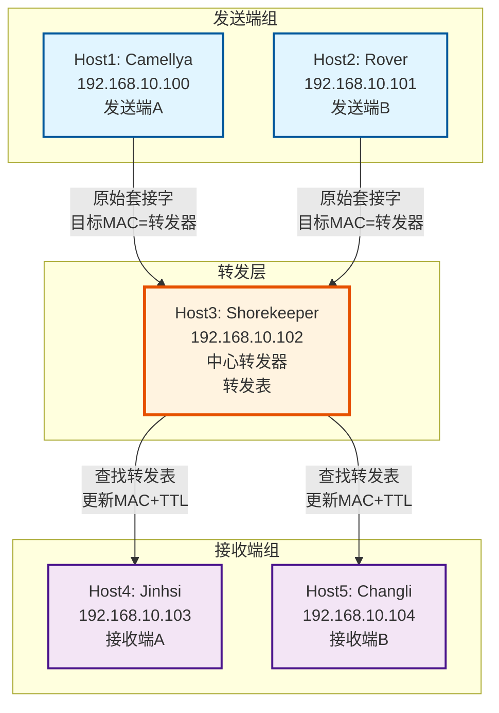
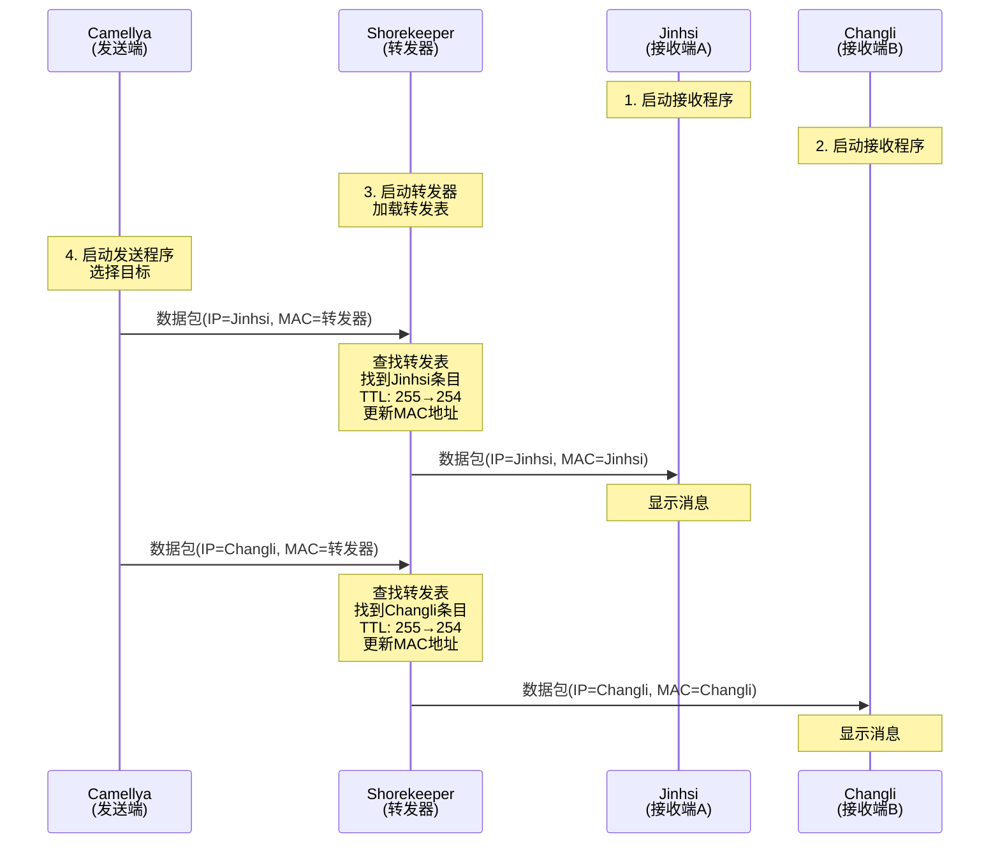
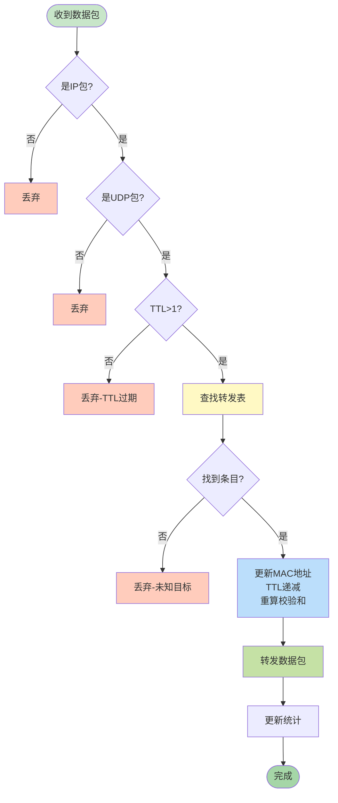

# Lab4-2增强版网络拓扑图

## 星型拓扑结构



## 数据流示意图



## 转发表结构

```
╔════════════════════════════════════════════════════════════════╗
║                      转发表 (Forwarding Table)                 ║
╠════════════════════════════════════════════════════════════════╣
║ 目标IP          │ 目标MAC               │ 描述      │ 计数   ║
╠════════════════════════════════════════════════════════════════╣
║ 192.168.10.103  │ 00:0c:29:6d:5e:8a    │ Jinhsi    │   0    ║
║ 192.168.10.104  │ 00:0c:29:7f:3a:2b    │ Changli   │   0    ║
╚════════════════════════════════════════════════════════════════╝
```

## 以太网帧和IP包的变化

### 阶段1：发送端发出

```
┌─────────────────────────────────────────────────────────────┐
│ 以太网帧头                                                    │
│ 源MAC: Camellya的MAC                                         │
│ 目标MAC: Shorekeeper的MAC (转发器)                           │
├─────────────────────────────────────────────────────────────┤
│ IP头                                                         │
│ 源IP: 192.168.10.100 (Camellya)                             │
│ 目标IP: 192.168.10.103 (Jinhsi) ← 最终目标                  │
│ TTL: 255                                                     │
├─────────────────────────────────────────────────────────────┤
│ UDP头 + 数据                                                 │
└─────────────────────────────────────────────────────────────┘
```

### 阶段2：转发器处理

```
1. 接收数据包
2. 解析IP头，提取目标IP = 192.168.10.103
3. 查找转发表：192.168.10.103 → Jinhsi (00:0c:29:6d:5e:8a)
4. 修改以太网帧头：
   - 源MAC = Shorekeeper的MAC
   - 目标MAC = Jinhsi的MAC
5. 修改IP头：
   - TTL = TTL - 1 (255 → 254)
   - 重新计算校验和
6. 转发数据包
```

### 阶段3：接收端收到

```
┌─────────────────────────────────────────────────────────────┐
│ 以太网帧头                                                    │
│ 源MAC: Shorekeeper的MAC (转发器)                             │
│ 目标MAC: Jinhsi的MAC                                         │
├─────────────────────────────────────────────────────────────┤
│ IP头                                                         │
│ 源IP: 192.168.10.100 (Camellya) ← 保持不变                  │
│ 目标IP: 192.168.10.103 (Jinhsi) ← 保持不变                  │
│ TTL: 254 ← 递减了1                                          │
├─────────────────────────────────────────────────────────────┤
│ UDP头 + 数据                                                 │
└─────────────────────────────────────────────────────────────┘
```

## 关键观察点

### IP地址变化
- **源IP**：始终是 192.168.10.100 (发送端)
- **目标IP**：始终是 192.168.10.103 (接收端)
- **结论**：IP地址在转发过程中保持不变

### MAC地址变化
- **发送时**：目标MAC = 转发器MAC
- **转发时**：目标MAC = 接收端MAC
- **结论**：MAC地址在每一跳都会改变

### TTL变化
- **发送时**：TTL = 255
- **转发后**：TTL = 254
- **结论**：每经过一个路由器，TTL递减1

## 转发决策流程



## 主机配置快速参考

| 主机 | IP | MAC (示例) | 角色 | 程序 | ROOT |
|------|----|-----------|----|------|------|
| Camellya | 192.168.10.100 | 00:0c:29:2a:7b:1c | 发送端A | send_raw_enhanced | ✓ |
| Rover | 192.168.10.101 | 00:0c:29:4f:8e:3d | 发送端B | send_raw_enhanced | ✓ |
| Shorekeeper | 192.168.10.102 | 00:0c:29:3e:1e:4c | 转发器 | forward_raw_enhanced | ✓ |
| Jinhsi | 192.168.10.103 | 00:0c:29:6d:5e:8a | 接收端A | recv_raw_enhanced | ✗ |
| Changli | 192.168.10.104 | 00:0c:29:7f:3a:2b | 接收端B | recv_raw_enhanced | ✗ |

⚠️ **注意**：上表中的MAC地址仅为示例，请使用 `ip a` 命令查看实际MAC地址！

## 扩展性说明

### 如何添加第6台主机（接收端C）？

1. **在转发器中添加转发表条目**：
```c
// 条目3: 新接收端
strcpy(forward_table[2].dest_ip, "192.168.10.105");
forward_table[2].dest_mac[0] = 0x??; // 填入实际MAC
// ...
forward_table_size = 3;
```

2. **在发送端中添加目标选项**：
```c
TargetHost targets[] = {
    {"Jinhsi", "192.168.10.103"},
    {"Changli", "192.168.10.104"},
    {"NewHost", "192.168.10.105"}  // 新增
};
```

3. 重新编译并部署。

### 转发表vs硬编码的优势

| 特性 | 硬编码方式 | 转发表方式 |
|-----|----------|-----------|
| 扩展性 | 差（需修改代码） | 优（只需配置） |
| 灵活性 | 固定目标 | 动态目标 |
| 通用性 | 专用程序 | 通用程序 |
| 维护性 | 难（每次改代码） | 易（只改配置） |
| 可移植性 | 差 | 优 |

这就是为什么本实验采用转发表机制的原因！
