# 实验4.1 网络拓扑图

## 基本拓扑结构

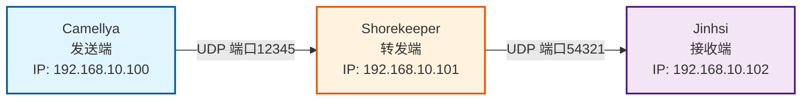

## 详细数据流动图

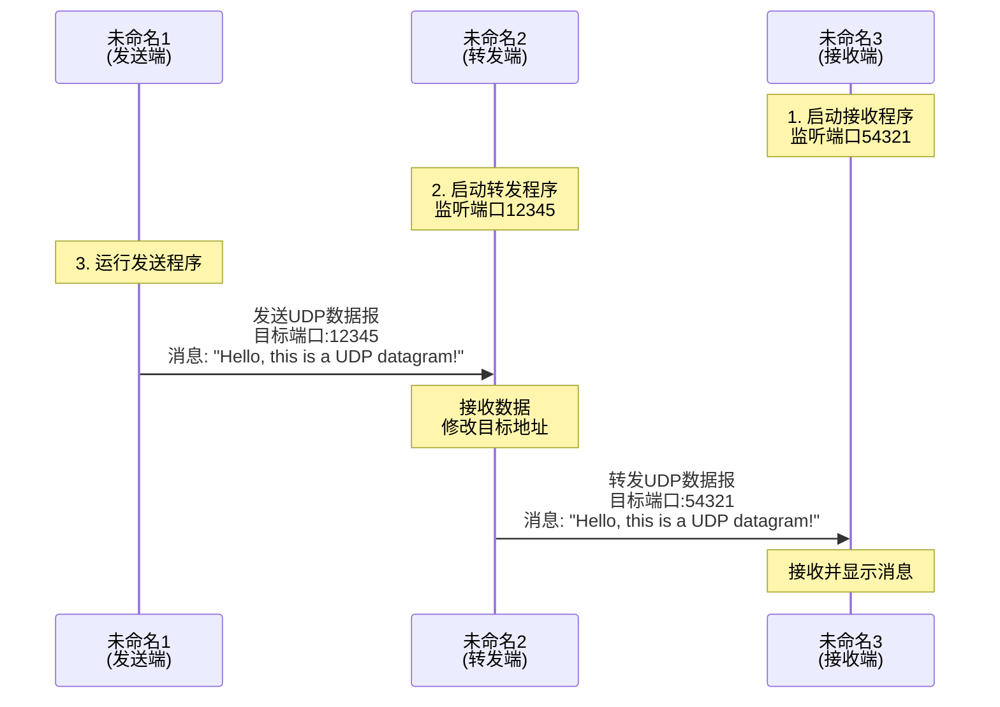

## 网络层次结构

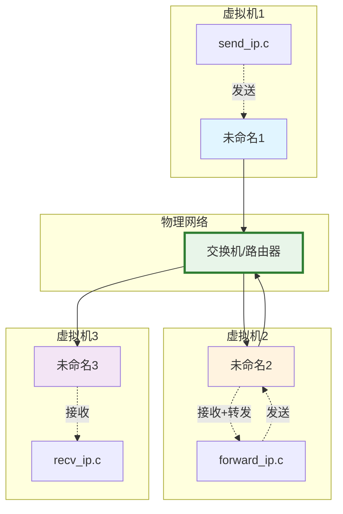

## 端口映射关系

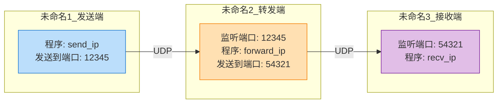

## 数据包结构

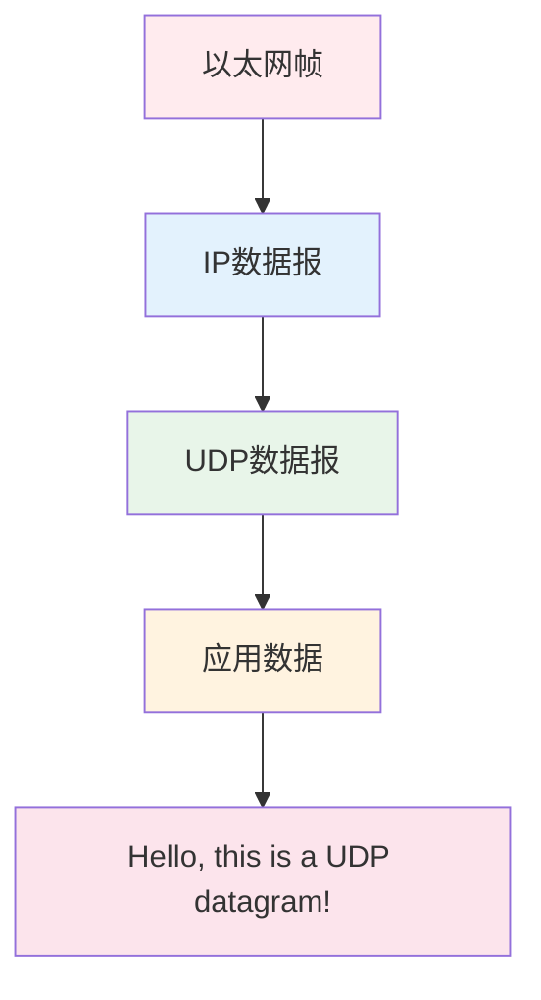

## 实验步骤流程图

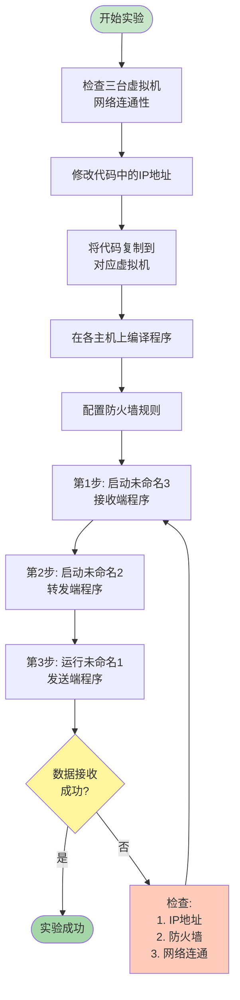

---

# 实验4.3 网络拓扑图 - 基于双网口主机的路由转发

## 基本拓扑结构

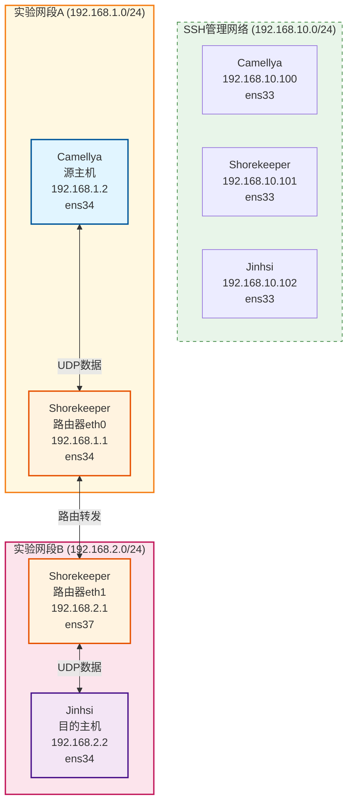

## 详细双网卡路由拓扑

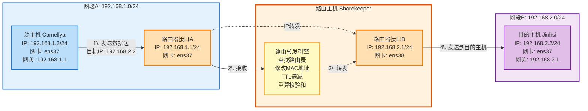

## 数据包转发流程

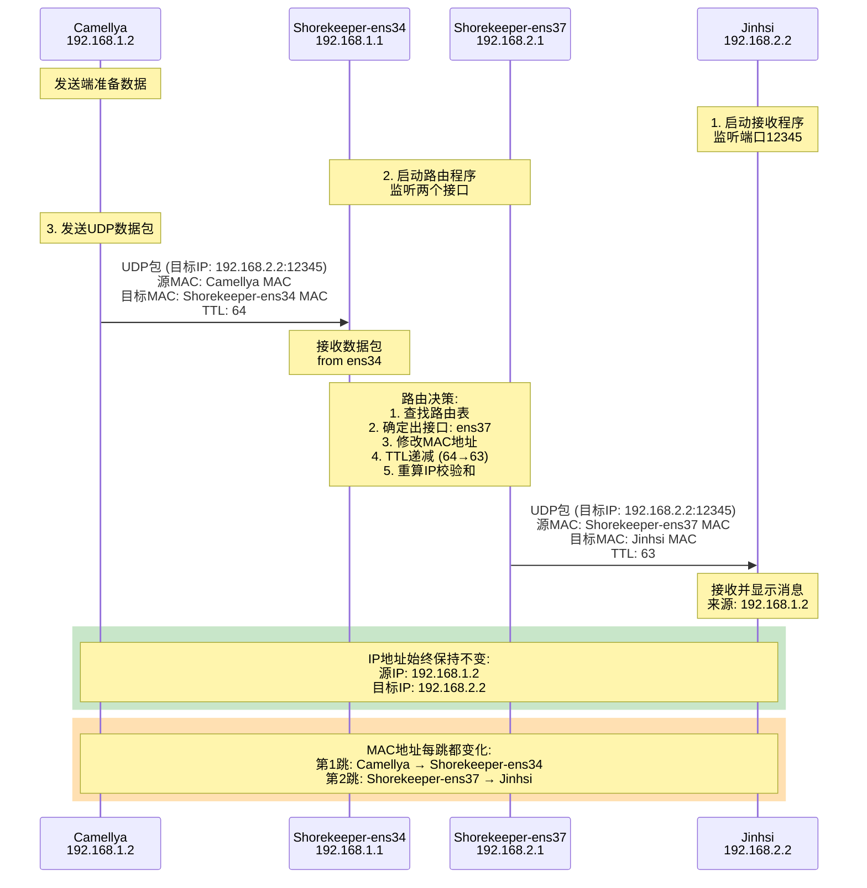

## 网卡配置详细图

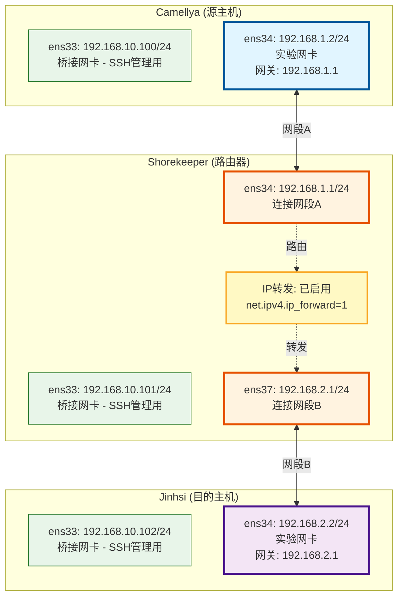

## 路由表示意图

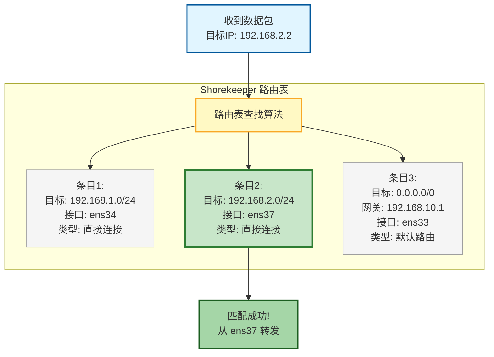

## MAC地址和IP地址变化对比

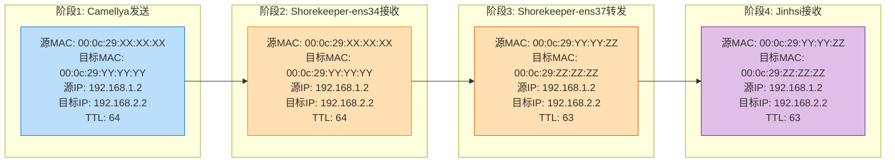

## 实验配置步骤流程

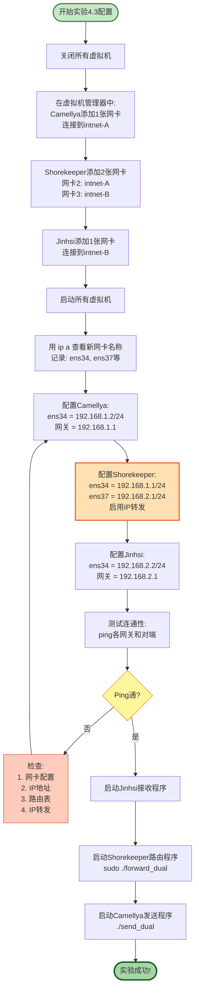
